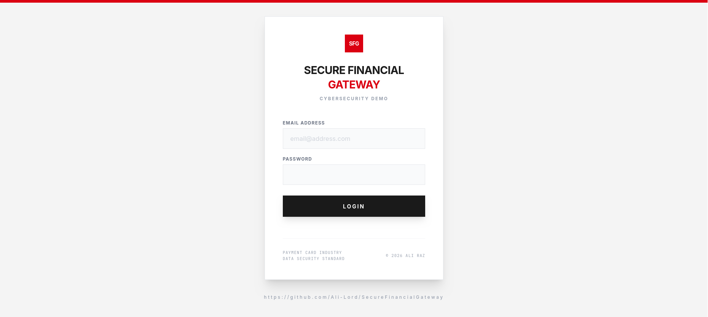
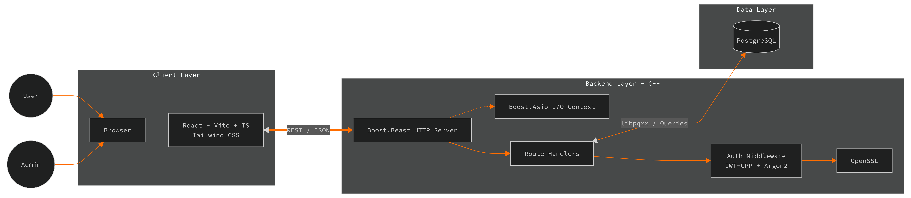

# Secure Financial Gateway
A practical demo of **low-level** cybersecurity code handling financial operations. It's designed with PCI DSS (Payment Card Industry Data Security Standard) compliance in mind, and I'll continuously improve and strengthen it to uphold top-tier security practices and ensure the highest standards of privacy.

**Backend:** Boost.Beast (C++), JWT-CPP, OpenSSL, Argon2, CMake <br/>
**Frontend:** Vite + React TypeScript + Tailwind <br/>
**Database:** PostgreSQL




## Security Focus (Key Controls Implemented)
- **TLS 1.3 exclusive** by configuring the OpenSSL context (manually disabling legacy protocols)
- **PCI DSS** (Payment Card Industry Data Security Standard)
- **JWT validation middleware** - full claim verification using Bearer tokens
- **Prepared statements** for every database operation (libpqxx) - preventing SQL injection
- **Audit logging** for key actions (metadata only, no sensitive data)
- **Axios interceptors** for automatic token handling and refresh
- **Cryptographic identity & password hardening system** where passward is stored as hash (Argon2id)
- **Custom built base64 PHC format**, a gold standard for storing hashes in databases
- **HSTS** - to never attempt a connection over unencrypted HTTP
- **Anti-Sniffing & circlejacking headers** to prevent the browser from being tricked into executing malicious code

## TODO LIST
- **OAuth2** Resource Server
- **RS256** instead of HS256
- **Strict CSP** and input sanitization on React side
- **httpOnly** cookie
- **Token ghost** prevention
- **Rate limiting** on API endpoints (Asio timer)
- **Refactor to parameterized queries** by replacing ALL static execution

> [!NOTE]
> As this is a cybersecurity **demo** project, everything is ran locally (localhost) inside an Alpine Linux Podman container.
> Also, there's no `./build.sh` provided to get you started. I use Vim as my primary editor so the repository contains no IDE-specific configuration files. Simply clone the repository and open it with your preferred editor on GNU/Linux (will probably compile fine on Windows and MacOS with minor configuration, but it's untested as I use Gentoo distro for development).

## For Alpine Linux container (Podman)
### Required
postgresql16-dev, boost-dev, openssl-dev, cmake, make, g++, linux-headers, JWT-CPP (v0.7.2) (TODO: update the required)

### libpqxx installation
If you're using the Alpine Linux v3.23 container, you won't have libpqxx and will have to build it from source. Follow my instructions.

```
# Download libpqxx
cd /tmp
wget https://github.com/jtv/libpqxx/archive/refs/tags/8.0.0.tar.gz -O libpqxx-8.0.0.tar.gz

tar -xzf libpqxx-8.0.0.tar.gz
cd libpqxx-8.0.0

# Build and install
mkdir build && cd build
cmake .. -DCMAKE_BUILD_TYPE=Release -DCMAKE_INSTALL_PREFIX=/usr
make -j$(nproc)
make install
```

### JWT installation
```
git clone https://github.com/Thalhammer/jwt-cpp.git

cd jwt-cpp
cmake .
cmake --build
cmake --install .
```

### Database setup
```
TODO
```

### Server setup instructions
Assuming you've configured your PostgreSQL database my way, the following should help you get your server ready.
```
su - postgres -c "pg_ctl -D /var/lib/postgresql/data -l /var/lib/postgresql/logfile start"

export SFG_JWT_SECRET=tmp123 # For the sake of demo
export SFG_JWT_ISSUER=sfg-gateway
export SFG_JWT_AUDIENCE=sfg-gateway-api
export DB_USER=sfg_user
export DB_PASSWORD=tmp123 # For the sake of demo
```

### Server start
To start the backend server:
`./backend/build/SecureFinancialGateway`

To start the vite server:
```
cd frontend
npm run dev
```

If you're running it int a container and have port-forwarded 5173:
>[!WARNING]
> The bottom command exposes your develpment server to your entire local network and depending on your network configration, maybe even the public network.
```
cd frontend
npm run dev -- --host 0.0.0.0

```

